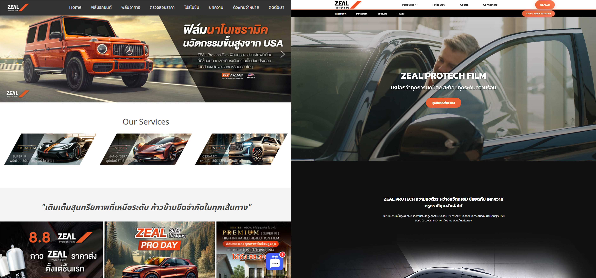
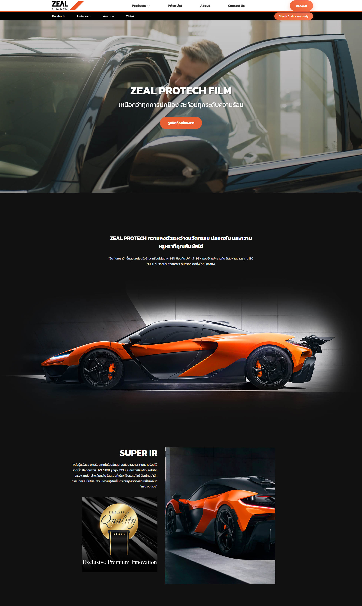

# เว็บไซต์ ZEAL PROTECH (zealprotech.com) - Custom UI/UX Renewal

โปรเจคนี้คือ "Showcase" (ป้ายแสดงผลงาน) สำหรับการ "Renew" (สร้างใหม่) เว็บไซต์ zealprotech.com ทั้งหมด โดยเปลี่ยนจากระบบ WordPress เดิม มาเป็น Static Website ที่ฉันเขียนขึ้นเองทั้งหมดด้วย HTML, CSS และ JavaScript

> **หมายเหตุ:** จุดเด่นของโปรเจคนี้คือการ **Custom Development** สร้างทุกฟังก์ชันและฟีเจอร์ขึ้นมาเองจากศูนย์ (from scratch) โดยไม่ใช้ Template หรือ Builder เพื่อให้ได้เว็บไซต์ที่ "เร็ว" (Optimized) และมีดีไซน์ที่ตรงตามความต้องการของแบรนด์ 100%

---

## 🚀 Live Demo

คุณสามารถเข้าชมเว็บไซต์ที่ทำงานจริงได้ที่:
**[https://zealprotech.com](https://zealprotech.com)**

---

## 1. ปัญหาที่เจอก่อนทำ (The Problem)

* **ระบบเดิม (WordPress):** เว็บไซต์เดิมเป็น WordPress ที่ทีมเก่าดูแล ทำให้มีข้อจำกัดด้านดีไซน์และ Performance
* **UI/UX และ Branding ที่ล้าสมัย:** ดีไซน์, โลโก้, และข้อมูลเดิม ไม่สอดคล้องกับภาพลักษณ์ใหม่ของแบรนด์ ZEAL PROTECH

## 2. การแก้ปัญหา (The Solution)

ฉันได้ทำการ "Renew" ใหม่ทั้งหมด โดยมีเป้าหมายคือ:

1.  **Total UI/UX & Branding Overhaul:** ปรับดีไซน์, โลโก้, รูปภาพ และข้อมูลเนื้อหาใหม่ทั้งหมดทุกหน้า ให้สะท้อนภาพลักษณ์ใหม่ของแบรนด์
2.  **Custom Static Site:** สร้างเว็บไซต์ใหม่ทั้งหมดด้วย **HTML, CSS, และ JavaScript** เพื่อให้ได้ Performance ที่ดีที่สุด, โหลดเร็ว, และปลอดภัย
3.  **Future-Proof Architecture:** วางโครงสร้างเว็บไซต์ให้ "พร้อม" สำหรับการอัปเกรดในอนาคต โดยมีแผนจะเปลี่ยนเป็น React/Next.js เพื่อเชื่อมต่อกับ "ระบบรับประกัน" (Warranty System) ที่ฉันพัฒนาไว้

---

## 3. Tech Stack ที่ใช้

* **Frontend:** HTML5, CSS3, JavaScript (ES6+)
* **(หมายเหตุ:** พัฒนาแบบ Custom Code 100% โดยไม่พึ่งพา Framework หรือ Library หนักๆ)

---

## 4. ฟีเจอร์เด่นๆ ที่ฉันทำ (Key Features)

### 🔷 การพัฒนาแบบ Custom (Custom Development)
* เขียนฟังก์ชันและฟีเจอร์ทั้งหมดของเว็บไซต์ (เช่น Sliders, Animations, Forms) ด้วย JavaScript ล้วนๆ
* สร้างเว็บไซต์ที่เบามาก (Lightweight) และโหลดได้รวดเร็ว (Optimized) เนื่องจากเป็น Static File ล้วนๆ

### 🔷 การยกเครื่อง UI/UX (Total UI/UX Overhaul)
* ออกแบบและพัฒนาหน้าเว็บใหม่ทั้งหมดทุกหน้า
* สร้าง Responsive Design ที่สมบูรณ์แบบ ให้ใช้งานได้ดีบนทุกอุปกรณ์

---

## 5. สิ่งที่ท้าทาย (Challenges)

* การสร้างฟีเจอร์ที่ซับซ้อน (เช่น Interactive elements) ด้วย JavaScript ล้วนๆ โดยไม่ใช้ Library ช่วย
* การปรับแต่ง Performance ของเว็บไซต์ (เช่น การโหลดรูปภาพ, การเขียน CSS) ให้ได้คะแนน PageSpeed ที่ดีที่สุด

## 6. สิ่งที่เรียนรู้จากโปรเจคนี้ (What I Learned)

* **ทักษะพื้นฐานที่แข็งแกร่ง:** ตอกย้ำความเชี่ยวชาญใน "หัวใจ" ของเว็บ (HTML, CSS, JavaScript) ซึ่งเป็นพื้นฐานสำคัญของการเป็นนักพัฒนาเว็บ
* **Website Optimization:** เรียนรู้เทคนิคการทำ Static Site ให้โหลดเร็วและมีประสิทธิภาพสูงสุด
* **การวางแผนสถาปัตยกรรม:** เข้าใจวิธีวางโครงสร้างโปรเจค HTML/CSS ธรรมดา ให้สามารถ "อัปเกรด" ไปเป็น Framework ที่ซับซ้อนอย่าง React/Next.js ในอนาคตได้